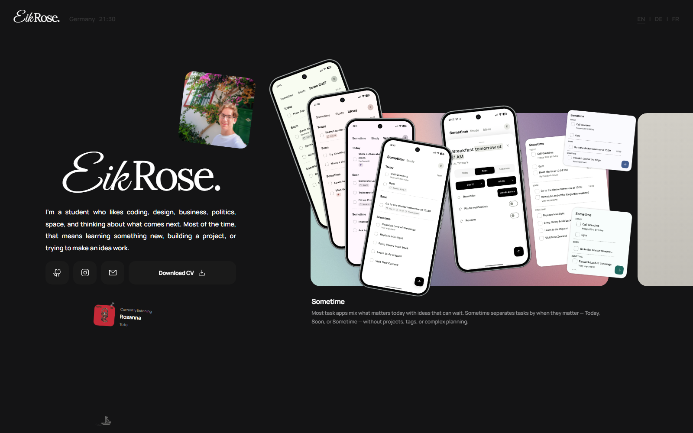

<p align="center">
  
</p>

<h1 align="center">Personal Portfolio</h1>

<p align="center">
  My personal portfolio website — a place for the projects I build and the things I’m curious about.<br>
  <a href="https://eikrose.de">eikrose.de</a>
</p>



## About

I’m Eik, a student interested in coding, design, technology, and what comes next. This website brings together my projects, interests, and work in one place.

## Features

- A horizontal desktop layout with a responsive mobile view.
- English, German, and French localization.
- Interactive project presentations, including Sometime’s layered phone showcase.
- Subtle animations, photo interactions, and a custom ship scroll indicator.
- Keyboard navigation, accessible dialogs, and reduced-motion support.

## Tech

React · TypeScript · Vite · CSS · Phosphor Icons

Typography: self-hosted, subsetted WOFF2 versions of Manrope, Lora, and Great Vibes.

## Running locally

```sh
npm ci
npm run dev
```

Build for production:

```sh
npm run build
```

The build includes a localized custom 404 page. See [deployment notes](docs/deployment.md) for static hosting and the Cloudflare domain redirect setup.
